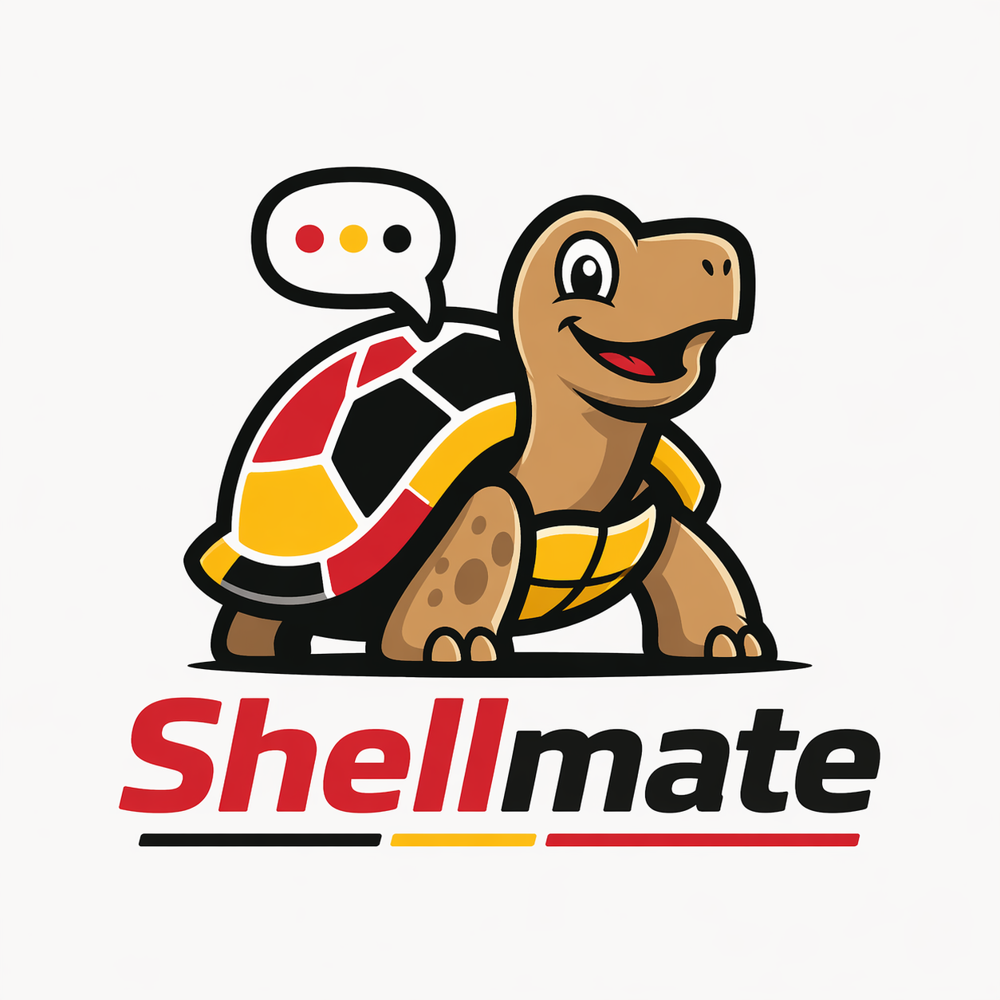
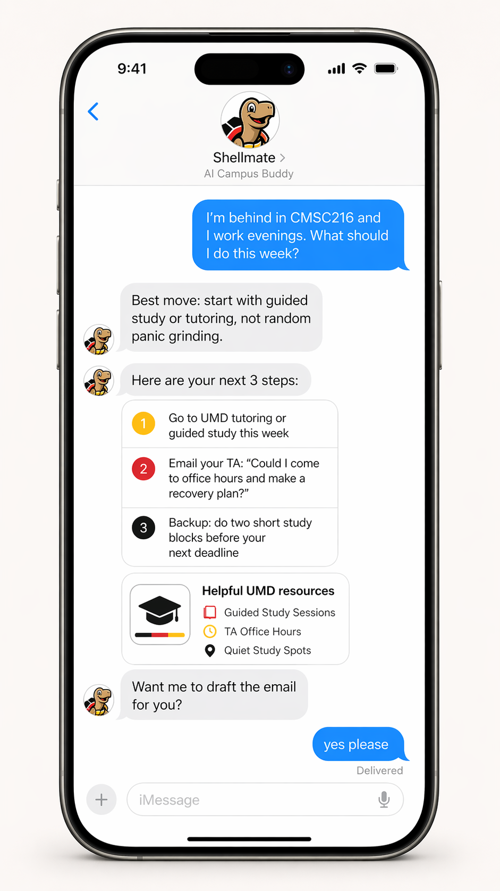
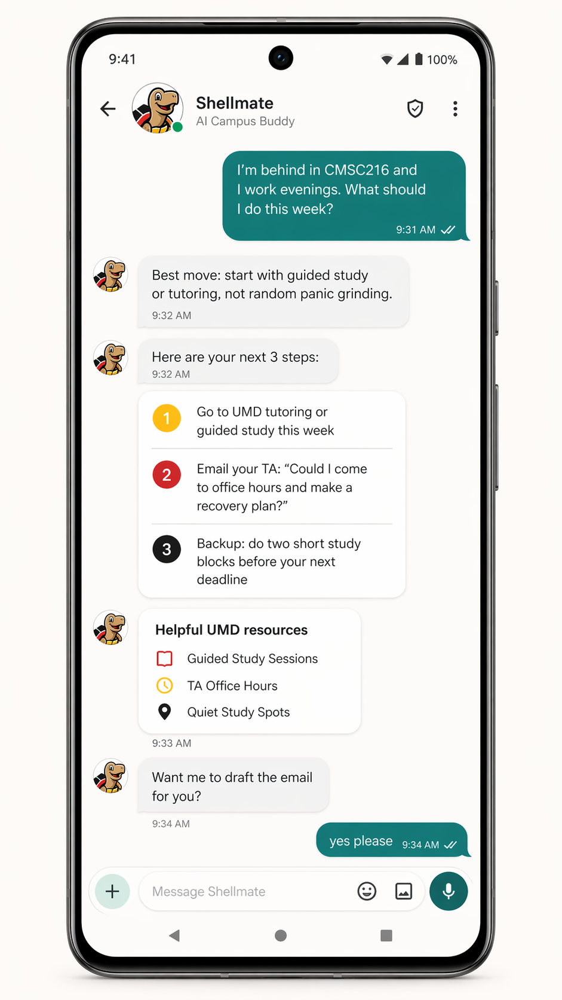
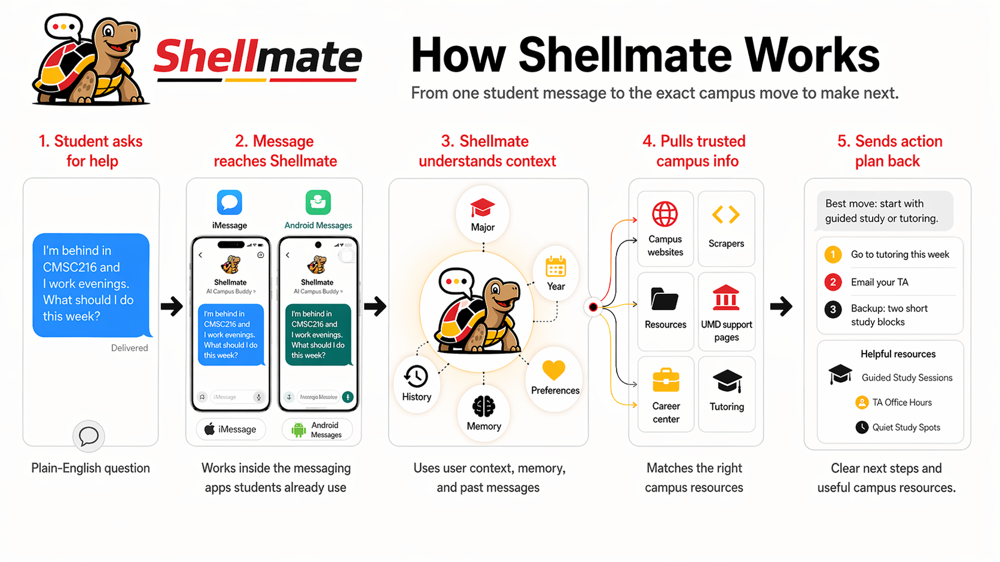

<div align="center">
  
  <p><strong>A campus buddy for UMD students — reachable by text.</strong></p>
</div>

---

## Inspiration

College campuses have a lot of support, but finding it is weirdly hard. Resources are scattered across department pages, PDFs, portals, emails, advising websites, scholarship pages, and career center links. The students who need help the most often have to know the "hidden curriculum" of college just to find the right office, deadline, or person to email.

Shellmate was inspired by that gap. We wanted to build something that feels less like a campus directory and more like a smart older student you can text when you do not know what to do next.

---

## What it does

Shellmate is a campus buddy that students can access directly through iMessage or regular SMS. Instead of downloading another campus app or digging through scattered websites, students can simply text Shellmate when they need help.

A student can ask things like:

- "I'm behind in my class, what should I do this week?"
- "I'm first-gen and need scholarship help."
- "I need resume help before applying to internships."
- "I have time between classes, where should I study?"
- "I don't know who to email about this."

Shellmate responds with clear next steps, relevant campus resources, and practical guidance. Instead of dumping a list of links, it explains what to do first, why that resource fits, and what action the student should take next.

<div align="center">
  
  &nbsp;&nbsp;&nbsp;
  
</div>

---

## How we built it

We built Shellmate as a messaging-first campus assistant reachable through iMessage or SMS. The system is designed around a simple loop:

```
Student Text → Context Understanding → Resource Matching → Actionable Reply
```

<div align="center">
  
</div>

Incoming messages arrive via [Sendblue](https://sendblue.co) webhook and are forwarded to the Shellmate backend. The backend handles chat logic, user context, memory, and resource routing. It understands the student's plain-English problem, matches it with relevant campus information, and returns a short action plan back through text.

**Stack:**

- **FastAPI** server with two routes: a Sendblue webhook and a debug chat endpoint for local testing
- **OpenAI Agents SDK** — a `chat_agent` that can hand off to a `scraper_agent` for deeper research
- **SQLite** for per-user profiles, preferences, and conversation history
- **Local knowledge base** — `umd_kb*.md` files scanned by token frequency to surface relevant UMD resources
- **Live scraper tools** — Exa + Parallel discovery and Firecrawl page extraction under `server/scrapers/`
- **Sendblue** for iMessage/SMS delivery

The system detects when a question needs deeper research and handles it asynchronously: it sends an acknowledgement immediately and delivers the full answer in a follow-up text once the background search completes.

---

## Challenges we ran into

One of the biggest challenges was narrowing the scope. A campus assistant can become huge very quickly: tutoring, financial aid, career prep, scheduling, events, clubs, mental health, food support, advising, and more. For the hackathon, we had to focus on the sharpest version of the idea: helping students turn confusion into one clear next step.

Another challenge was making the assistant feel useful instead of generic. A lot of chatbots answer questions, but students need action. So we focused on response formats that include:

- what to do first
- why it matters
- who to contact
- what to say
- a backup option

We also had to think carefully about trust. Campus advice should be grounded in real sources, especially when it involves deadlines, eligibility, or support services. This pushed us toward building Shellmate as a source-backed campus intelligence layer rather than just a general chatbot.

---

## Accomplishments that we're proud of

We are proud that Shellmate feels simple on the surface but solves a real problem underneath. The interface is just a text conversation, but behind it is the idea of connecting students to the right campus support at the right time.

We are also proud of the equity angle. Shellmate helps reduce the advantage gap between students who already know how to navigate college and students who are still figuring it out. The product is not just about convenience. It is about making opportunity easier to access.

We also created a brand and product direction that feels student-native: friendly, casual, practical, and UMD-inspired.

---

## What we learned

We learned that the biggest student support problem is often not the absence of resources. It is discovery, timing, and confidence.

A student may not know:

- what a campus office actually does
- whether they are eligible for a program
- how to phrase an email
- whether their problem is "serious enough" to ask for help
- which resource to try first

We also learned that a good AI assistant should not only answer questions. It should reduce friction. Sometimes the most valuable output is not a long explanation. It is a simple sentence like:

> "Do this first, and here's the next step."

---

## What's next for Shellmate

Future improvements include:

- expanding the UMD resource database
- adding source citations for every recommendation
- using the live scraping tools for updated deadlines and resources
- expanding to WhatsApp, Discord, and GroupMe
- proactive reminders for deadlines and opportunities
- a campus insights dashboard showing what students are struggling to find

Long term, Shellmate could become a student success layer for universities: one simple text interface for students, and one intelligence system that helps campuses understand where support is not reaching people.

**Shellmate's mission is simple: students should not need insider knowledge to get help.**

---

## Running locally

```bash
# From the server/ directory
uv pip install -e .
uv run uvicorn server.main:app --reload --host 0.0.0.0 --port 8000
```

Test without Sendblue:

```bash
curl -X POST http://localhost:8000/api/debug/chat \
  -H "Content-Type: application/json" \
  -d '{"phone": "+12025551234", "text": "where can I find tutoring?"}'
```

Copy `.env` into `server/.env` and set `OPENAI_API_KEY`. Sendblue vars are optional — omit them to use the debug endpoint only.

For live scraping, set `EXA_API_KEY`, `PARALLEL_API_KEY`, and `FIRECRAWL_API_KEY`. The reusable scraper implementation is in `server/scrapers/umd_live.py`, the ingestion command is `python3 scripts/ingest_umd_live.py`, and the OpenAI scraper handoff exposes `scraper_search`, `search_umd_web`, and `scrape_umd_url` as tools.
